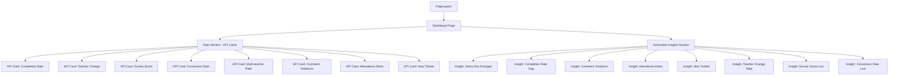
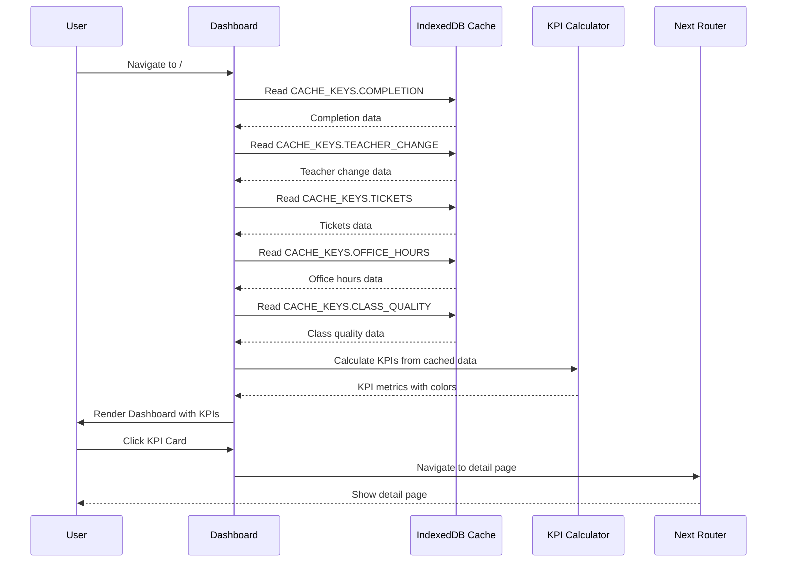

# Design Document: Dashboard Homepage Restructure

## Overview

This design document outlines the technical architecture for restructuring the MindX KPI Dashboard homepage. The current "/" route displays the Completion Rate page. This restructure will:

1. Move the Completion Rate page to `/completion-rate`
2. Create a new Dashboard overview page at `/` that aggregates key metrics from all pages
3. Update navigation to reflect the new structure

The new Dashboard will serve as a central hub, displaying KPI cards and actionable insights, enabling users to quickly assess overall system health without navigating to individual pages.

## Architecture

### High-Level Route Structure

```mermaid
graph TD
    A[/ - Dashboard Overview] --> B[/completion-rate - Tỷ lệ Hoàn thành]
    A --> C[/teacher-change - Tỷ lệ thay đổi GV]
    A --> D[/tickets - Phiếu Đánh giá]
    A --> E[/class-quality - Chất lượng Lớp học]
    A --> F[/office-hours - Ca Trải nghiệm]
    A --> G[/teacher-schedule - Lịch Giảng dạy]
    A --> H[/admin/* - Quản trị Hệ thống]
```

### Component Hierarchy



### Data Flow



## Components

### 1. Dashboard Page Component (`src/app/page.tsx`)

**Purpose**: Main dashboard overview page that aggregates metrics from all feature pages.

**State Management**:
```typescript
// Cache data from all pages
const [completionData, setCompletionData] = useState<any>(null);
const [teacherChangeData, setTeacherChangeData] = useState<any>(null);
const [ticketsData, setTicketsData] = useState<any>(null);
const [officeHoursData, setOfficeHoursData] = useState<any>(null);
const [classQualityData, setClassQualityData] = useState<any>(null);

// Loading states
const [loading, setLoading] = useState(true);
const [error, setError] = useState<string | null>(null);

// Permissions
const { allowedPages, loading: permissionsLoading } = useAllowedPages();
```

**Key Functions**:
- `loadCachedData()`: Load all cached data from IndexedDB
- `calculateKPIs()`: Calculate KPI metrics from cached data
- `handleRefreshAll()`: Clear all caches and prompt user to reload data
- `handleKPIClick(page)`: Navigate to detail page

### 2. KPI Card Component

**Purpose**: Display a single KPI metric with value, color, and link to detail page.

**Props**:
```typescript
interface KPICardProps {
  label: string;           // e.g., "Tỷ lệ Hoàn thành"
  value: string;           // e.g., "92.5%"
  description: string;     // e.g., "450 / 487 học viên"
  color: string;           // KPI color from kpiScoring
  icon: React.ReactNode;   // Icon component
  href: string;            // Link to detail page
  delay: number;           // Animation delay
  lastUpdated?: string;    // Last cache update timestamp
}
```

**Implementation**:
```typescript
export function KPICard({ label, value, description, color, icon, href, delay, lastUpdated }: KPICardProps) {
  const router = useRouter();
  
  return (
    <motion.div
      className={styles.kpiCard}
      initial={{ opacity: 0, y: 16 }}
      animate={{ opacity: 1, y: 0 }}
      transition={{ duration: 0.3, delay }}
      onClick={() => router.push(href)}
    >
      <div className={styles.kpiHeader}>
        <span className={styles.kpiIcon}>{icon}</span>
        <span className={styles.kpiLabel}>{label}</span>
      </div>
      <div className={styles.kpiValue} style={{ color }}>{value}</div>
      <div className={styles.kpiDescription}>{description}</div>
      {lastUpdated && (
        <div className={styles.kpiTimestamp}>
          Cập nhật: {lastUpdated}
        </div>
      )}
    </motion.div>
  );
}
```

### 3. Actionable Insight Component

**Purpose**: Display actionable insights and suggestions based on KPI data.

**Props**:
```typescript
interface ActionableInsightProps {
  title: string;           // e.g., "5 lớp chưa sắp xếp thuyết trình cuối khóa"
  description: string;     // e.g., "Cần xử lý"
  severity: 'good' | 'warning' | 'critical';
  icon: React.ReactNode;
  href: string;            // Link to filtered view
  delay: number;
}
```

**Implementation**:
```typescript
export function ActionableInsight({ title, description, severity, icon, href, delay }: ActionableInsightProps) {
  const router = useRouter();
  const severityColors = {
    good: 'var(--status-success)',
    warning: 'var(--status-warning)',
    critical: 'var(--status-error)',
  };
  
  return (
    <motion.div
      className={styles.insightCard}
      initial={{ opacity: 0, y: 16 }}
      animate={{ opacity: 1, y: 0 }}
      transition={{ duration: 0.3, delay }}
      onClick={() => router.push(href)}
      style={{ borderLeftColor: severityColors[severity] }}
    >
      <div className={styles.insightHeader}>
        <span className={styles.insightIcon} style={{ color: severityColors[severity] }}>
          {icon}
        </span>
        <div className={styles.insightContent}>
          <div className={styles.insightTitle}>{title}</div>
          <div className={styles.insightDescription}>{description}</div>
        </div>
      </div>
      <svg width="16" height="16" viewBox="0 0 24 24" fill="none" stroke="currentColor" strokeWidth="2">
        <polyline points="9 18 15 12 9 6" />
      </svg>
    </motion.div>
  );
}
```

## Data Models

### KPI Metrics

```typescript
interface KPIMetric {
  value: number;           // Raw value (e.g., 92.5 for 92.5%)
  formatted: string;       // Formatted display (e.g., "92.5%")
  description: string;     // Context (e.g., "450 / 487 học viên")
  color: string;           // KPI color from kpiScoring
  score: 1 | 2 | 3 | 4 | 5; // KPI score level
  lastUpdated: Date | null; // Cache timestamp
}

interface DashboardMetrics {
  completionRate: KPIMetric | null;
  teacherChangeRate: KPIMetric | null;
  surveyScore: KPIMetric | null;
  conversionRate: KPIMetric | null;
  multiTeacherRate: KPIMetric | null;
  commentViolations: CountMetric | null;
  attendanceAlerts: CountMetric | null;
  newTickets: CountMetric | null;
}

interface CountMetric {
  count: number;           // Raw count value
  formatted: string;       // Formatted display (e.g., "12 vi phạm")
  color: string;           // Color based on count thresholds
  lastUpdated: Date | null; // Cache timestamp
}
```

### Actionable Insight Data

```typescript
interface ActionableInsight {
  id: string;
  title: string;
  description: string;
  severity: 'good' | 'warning' | 'critical';
  href: string;
  priority: number;  // For sorting (higher = more important)
  visible: boolean;  // Based on threshold
}
```

### Count-Based Color Helper

```typescript
/**
 * Get color for count-based metrics using predefined thresholds
 * @param count - The count value
 * @param thresholds - Array of threshold values [t1, t2, t3, t4]
 *   - 0 = green
 *   - 1-t1 = lime
 *   - (t1+1)-t2 = amber
 *   - (t2+1)-t3 = orange
 *   - >t3 = red
 * @returns Hex color string
 */
function getCountColor(count: number, thresholds: [number, number, number, number]): string {
  if (count === 0) return KPI_COLORS[5]; // Green
  if (count <= thresholds[0]) return KPI_COLORS[4]; // Lime
  if (count <= thresholds[1]) return KPI_COLORS[3]; // Amber
  if (count <= thresholds[2]) return KPI_COLORS[2]; // Orange
  return KPI_COLORS[1]; // Red
}

// Predefined thresholds for each count-based metric
const COUNT_THRESHOLDS = {
  COMMENT_VIOLATIONS: [5, 10, 20, Infinity],    // 0, 1-5, 6-10, 11-20, >20
  ATTENDANCE_ALERTS: [3, 6, 10, Infinity],      // 0, 1-3, 4-6, 7-10, >10
  NEW_TICKETS: [5, 10, 20, Infinity],           // 0, 1-5, 6-10, 11-20, >20
};
```

### Cache Structure

The Dashboard reads from existing cache keys without modifying them:

```typescript
// CACHE_KEYS.COMPLETION
{
  classes: Class[];
  fromDate: string;
  toDate: string;
  includedReasons: Record<string, boolean>;
  excludedCourses: Record<string, boolean>;
  selectedCentres: string[];
}

// CACHE_KEYS.TEACHER_CHANGE
{
  classes: Class[];
  fromDate: string;
  toDate: string;
  selectedCentres: string[];
}

// CACHE_KEYS.TICKETS
{
  tickets: Ticket[];
  fromDate: string;
  toDate: string;
  selectedCentres: string[];
}

// CACHE_KEYS.OFFICE_HOURS
{
  sessions: OfficeHourSession[];
  fromDate: string;
  toDate: string;
  selectedCentres: string[];
}

// CACHE_KEYS.CLASS_QUALITY
{
  classes: Class[];
  fromDate: string;
  toDate: string;
  selectedCentres: string[];
}
```

## Correctness Properties

*A property is a characteristic or behavior that should hold true across all valid executions of a system—essentially, a formal statement about what the system should do. Properties serve as the bridge between human-readable specifications and machine-verifiable correctness guarantees.*

### Property 1: KPI Calculation Consistency

*For any* cached data set, calculating KPI metrics multiple times SHALL produce identical results.

**Validates: Requirements 16.1, 16.2, 16.3, 16.4, 16.5, 16.6, 16.7, 16.8**

### Property 2: Permission Filtering

*For any* user with a specific set of allowed pages, the Dashboard SHALL only display KPI cards and insights for pages in the allowed set.

**Validates: Requirements 9.2, 9.3**

### Property 3: Insight Generation Consistency

*For any* set of KPI metrics, generating insights multiple times SHALL produce the same set of insights with consistent severity levels.

**Validates: Requirements 17.1, 17.2, 17.3, 17.4, 17.5, 17.6, 17.7**

### Property 4: Count-Based Color Consistency

*For any* count value and threshold array, the color calculation SHALL always return the same color for the same inputs.

**Validates: Requirements 18.1, 18.2, 18.3, 18.4**

### Property 5: Navigation Consistency

*For any* clickable element (KPI card, insight card), clicking SHALL navigate to the correct detail page without errors.

**Validates: Requirements 3.11, 4.11**

### Property 6: Cache Read Safety

*For any* missing or corrupted cache entry, the Dashboard SHALL handle the error gracefully and display "N/A" or appropriate fallback without crashing.

**Validates: Requirements 10.1, 10.2, 10.5**

### Property 7: Responsive Layout Adaptation

*For any* viewport width, the Dashboard SHALL display the correct number of columns per the responsive breakpoints without overflow.

**Validates: Requirements 6.2, 6.3, 6.4, 6.5**

## Error Handling

### Cache Read Errors

```typescript
async function loadCachedData() {
  try {
    const completionCache = await getCache(CACHE_KEYS.COMPLETION);
    setCompletionData(completionCache);
  } catch (error) {
    console.error('Failed to load completion cache:', error);
    addToast(MESSAGES.ERROR.GENERIC, 'error');
    setCompletionData(null);
  }
  
  // Repeat for other caches...
}
```

### KPI Calculation Errors

```typescript
function calculateCompletionRate(data: any): KPIMetric | null {
  try {
    if (!data?.classes || data.classes.length === 0) {
      return null;
    }
    
    const totalPass = data.classes.reduce((acc, cls) => acc + cls.clsPass, 0);
    const totalBase = data.classes.reduce((acc, cls) => acc + cls.effectiveBase, 0);
    
    if (totalBase === 0) {
      return null;
    }
    
    const rate = (totalPass / totalBase) * 100;
    const score = completionScore(rate);
    const color = completionColor(rate);
    
    return {
      value: rate,
      formatted: FORMAT.percentage(rate),
      description: `${totalPass} / ${totalBase} học viên`,
      color,
      score,
      lastUpdated: data.lastUpdated ? new Date(data.lastUpdated) : null,
    };
  } catch (error) {
    console.error('Failed to calculate completion rate:', error);
    return null;
  }
}
```

### Navigation Errors

```typescript
function handleKPIClick(href: string) {
  try {
    router.push(href);
  } catch (error) {
    console.error('Navigation failed:', error);
    addToast('Không thể điều hướng. Vui lòng thử lại.', 'error');
  }
}
```

## Testing Strategy

### Unit Tests

**KPI Calculation Tests**:
- Test `calculateCompletionRate()` with various data sets
- Test `calculateTeacherChangeRate()` with edge cases (0 classes, all changed, none changed)
- Test `calculateSurveyScore()` with missing scores
- Test `calculateConversionRate()` with 0 trial sessions

**Permission Filtering Tests**:
- Test KPI card visibility with different `allowedPages` sets
- Test quick link filtering with empty `allowedPages`
- Test alert visibility with permission restrictions

**Alert Threshold Tests**:
- Test alert visibility with counts below threshold
- Test alert visibility with counts at threshold
- Test alert visibility with counts above threshold

**Error Handling Tests**:
- Test cache read with missing cache
- Test cache read with corrupted data
- Test KPI calculation with null/undefined data
- Test navigation with invalid href

### Integration Tests

**Cache Integration**:
- Test loading all caches successfully
- Test handling mixed success/failure cache reads
- Test Dashboard behavior with no cached data

**Navigation Integration**:
- Test clicking KPI card navigates to correct page
- Test clicking alert card navigates with correct filters
- Test clicking quick link navigates to correct page

**Permission Integration**:
- Test Dashboard with admin user (all pages visible)
- Test Dashboard with restricted user (filtered pages)
- Test Dashboard with no permissions (empty state)

### Manual Testing Checklist

- [ ] Dashboard loads without errors
- [ ] All KPI cards display correct values
- [ ] KPI colors match kpiScoring functions
- [ ] Alerts display correct counts
- [ ] Alert thresholds work correctly
- [ ] Quick links navigate to correct pages
- [ ] Permission filtering works correctly
- [ ] Responsive layout works on all breakpoints
- [ ] Empty state displays when no cache data
- [ ] Error messages display for cache failures
- [ ] Navigation works from all clickable elements
- [ ] Last updated timestamps display correctly

## Integration Points

### 1. PageLayout Component

**Integration**: Dashboard uses `PageLayout` with `activePage="dashboard"`.

```typescript
<PageLayout title="Dashboard" activePage="dashboard">
  {/* Dashboard content */}
</PageLayout>
```

**Navigation Update**: Add "Dashboard" to sidebar navigation in `PageLayout.tsx`:

```typescript
<div 
  className={`${styles.sidebarLink} ${activePage === 'dashboard' ? styles.active : ''}`}
  onClick={() => { router.push('/'); handleSidebarToggle(false); }}
>
  <Icon.BarChart />
  Dashboard
</div>
```

### 2. Completion Rate Page

**File Move**: `src/app/page.tsx` → `src/app/completion-rate/page.tsx`

**Navigation Update**: Update sidebar link to point to `/completion-rate`:

```typescript
<div 
  className={`${styles.sidebarLink} ${activePage === 'completion' ? styles.active : ''}`}
  onClick={() => { router.push('/completion-rate'); handleSidebarToggle(false); }}
>
  <Icon.Table />
  Tỷ lệ Hoàn thành
</div>
```

### 3. Constants Integration

**New Labels** (add to `src/constants/index.ts`):

```typescript
export const LABELS = {
  // ... existing labels
  DASHBOARD: 'Dashboard',
  ACTIONABLE_INSIGHTS: 'Gợi ý Hành động',
  REFRESH_ALL: 'Làm mới tất cả',
  LAST_UPDATED: 'Cập nhật lần cuối',
  NO_PERMISSION: 'Bạn chưa có quyền truy cập',
  NO_DATA_AVAILABLE: 'Chưa có dữ liệu',
  LOAD_DATA_PROMPT: 'Vui lòng tải dữ liệu từ các trang chi tiết',
} as const;
```

```typescript
export const LABELS = {
  // ... existing labels
  DASHBOARD: 'Dashboard',
  QUICK_ACCESS: 'Truy cập nhanh',
  ALERTS: 'Cảnh báo',
  REFRESH_ALL: 'Làm mới tất cả',
  LAST_UPDATED: 'Cập nhật lần cuối',
  NO_PERMISSION: 'Bạn chưa có quyền truy cập',
  NO_DATA_AVAILABLE: 'Chưa có dữ liệu',
  LOAD_DATA_PROMPT: 'Vui lòng tải dữ liệu từ các trang chi tiết',
} as const;
```

### 4. KPI Scoring Integration

**Usage**: Import and use KPI scoring functions:

```typescript
import {
  completionColor,
  completionScore,
  teacherChangeColor,
  teacherChangeScore,
  surveyColor,
  surveyScore,
  conversionColor,
  conversionScore,
} from '@/lib/kpiScoring';
```

### 5. Cache Integration

**Read-Only Access**: Dashboard only reads from caches, never writes:

```typescript
import { getCache } from '@/lib/idb';
import { CACHE_KEYS } from '@/constants';

// Read completion data
const completionData = await getCache(CACHE_KEYS.COMPLETION);

// Read teacher change data
const teacherChangeData = await getCache(CACHE_KEYS.TEACHER_CHANGE);

// ... etc
```

### 6. Permission Integration

**Usage**: Use `useAllowedPages()` hook to filter visible elements:

```typescript
import { useAllowedPages } from '@/hooks/useAllowedPages';

const { allowedPages, loading: permissionsLoading } = useAllowedPages();

// Filter KPI cards
const visibleKPIs = kpiCards.filter(kpi => allowedPages.includes(kpi.page));

// Filter insights
const visibleInsights = insights.filter(insight => allowedPages.includes(insight.page));
```

## Design System Compliance

### Colors

**KPI Colors**: Use colors from `@/lib/kpiScoring`:
- Score 5: `#059669` (Emerald)
- Score 4: `#84cc16` (Lime)
- Score 3: `#d97706` (Amber)
- Score 2: `#f97316` (Orange)
- Score 1: `#dc2626` (Red)

**Count-Based Colors**: Use same KPI colors for count-based metrics:
- 0 count: `#059669` (Green - Emerald)
- Low count: `#84cc16` (Lime)
- Medium count: `#d97706` (Amber)
- High count: `#f97316` (Orange)
- Critical count: `#dc2626` (Red)

**Insight Severity Colors**:
- Good: `var(--status-success)` or `#059669`
- Warning: `var(--status-warning)` or `#d97706`
- Critical: `var(--status-error)` or `#dc2626`

**Background Colors**:
- Page canvas: `var(--bg-marketing)`
- Cards: `var(--bg-surface)`
- Hover: `var(--bg-elevated)`

### Spacing

**Grid Gaps**: Use spacing scale from design system:
- Stats grid gap: `var(--space-4)` (16px)
- Alerts grid gap: `var(--space-3)` (12px)
- Quick links gap: `var(--space-3)` (12px)
- Section margins: `var(--space-6)` (24px)

### Typography

**Headings**:
- Page title: h1 (32px, weight 510)
- Section titles: h2 (24px, weight 510)
- Card labels: 13px, weight 600

**Body Text**:
- KPI values: 32px, weight 590
- Descriptions: 13px, weight 400
- Timestamps: 11px, weight 400

### Border Radius

- Cards: `var(--radius-card)` (8px)
- Buttons: `var(--radius-comfortable)` (6px)

### Shadows

- Cards: `var(--shadow-card)`
- Hover: `var(--shadow-elevated)`

### Animation

**Timing**: Use constants from `@/constants`:
- Stat card delay: `ANIMATION.STAT_CARD_DELAY` (0.07s)
- Fade duration: `ANIMATION.FADE_DURATION` (0.25s)

**Stagger Animation**:
```typescript
{kpiCards.map((card, index) => (
  <KPICard
    key={card.id}
    {...card}
    delay={index * ANIMATION.STAT_CARD_DELAY}
  />
))}
```

## Responsive Layout

### Breakpoints

```css
/* Desktop large (≥1400px) - 4 columns */
@media (min-width: 1400px) {
  .statsGrid {
    grid-template-columns: repeat(4, 1fr);
  }
}

/* Desktop medium (≥1024px) - 3 columns */
@media (min-width: 1024px) {
  .statsGrid {
    grid-template-columns: repeat(3, 1fr);
  }
}

/* Tablet/small desktop (<1024px) - 2 columns */
@media (max-width: 1023px) {
  .statsGrid {
    grid-template-columns: repeat(2, 1fr);
  }
}

/* Mobile (<640px) - 1 column */
@media (max-width: 639px) {
  .statsGrid {
    grid-template-columns: 1fr;
  }
}
```

### Grid Layout

```css
.statsGrid {
  display: grid;
  gap: var(--space-4);
  margin-bottom: var(--space-6);
}

.insightsGrid {
  display: grid;
  grid-template-columns: repeat(auto-fill, minmax(320px, 1fr));
  gap: var(--space-3);
  margin-bottom: var(--space-6);
}
```

## File Structure

```
src/
├── app/
│   ├── page.tsx                          # NEW: Dashboard overview
│   ├── completion-rate/
│   │   └── page.tsx                      # MOVED: From src/app/page.tsx
│   ├── teacher-change/page.tsx
│   ├── tickets/page.tsx
│   ├── class-quality/page.tsx
│   ├── office-hours/page.tsx
│   └── teacher-schedule/page.tsx
├── components/
│   ├── PageLayout.tsx                    # UPDATED: Add dashboard nav
│   ├── ui/
│   │   └── index.tsx                     # Reuse existing components
│   └── dashboard/                        # NEW: Dashboard-specific components
│       ├── KPICard.tsx
│       └── ActionableInsight.tsx
├── constants/
│   └── index.ts                          # UPDATED: Add dashboard labels
├── lib/
│   ├── kpiScoring.ts                     # Existing KPI functions
│   └── idb.ts                            # Existing cache functions
└── hooks/
    └── useAllowedPages.ts                # Existing permissions hook
```

## Implementation Phases

### Phase 1: File Restructure
1. Create `src/app/completion-rate/` directory
2. Move `src/app/page.tsx` to `src/app/completion-rate/page.tsx`
3. Verify completion rate page works at new route
4. Update any hardcoded references to "/"

### Phase 2: Navigation Update
1. Update `PageLayout.tsx` to add "Dashboard" nav item
2. Update "Tỷ lệ Hoàn thành" nav to point to `/completion-rate`
3. Add `activePage="dashboard"` support
4. Test navigation from all pages

### Phase 3: Dashboard Components
1. Create `src/components/dashboard/` directory
2. Implement `KPICard.tsx` component
3. Implement `ActionableInsight.tsx` component
4. Add styles to `dashboard.module.css`

### Phase 4: Dashboard Page
1. Create new `src/app/page.tsx` for Dashboard
2. Implement cache reading logic
3. Implement KPI calculation logic (including count-based metrics)
4. Implement count-based color helper function
5. Implement insight generation logic with severity calculation
6. Add empty state and error handling

### Phase 5: Constants Update
1. Add new labels to `src/constants/index.ts`
2. Update all hardcoded text to use constants
3. Verify all labels display correctly

### Phase 6: Testing & Polish
1. Test all KPI calculations (percentage-based and count-based)
2. Test count-based color thresholds
3. Test insight generation and severity calculation
4. Test permission filtering
5. Test responsive layout
6. Test navigation from all elements
7. Test error handling
8. Fix any bugs found
9. Run `npm run build` to verify no errors

## Performance Considerations

### Memoization

```typescript
// Memoize KPI calculations
const completionMetric = useMemo(() => {
  return calculateCompletionRate(completionData);
}, [completionData]);

const teacherChangeMetric = useMemo(() => {
  return calculateTeacherChangeRate(teacherChangeData);
}, [teacherChangeData]);

// Memoize count-based metrics
const commentViolationsMetric = useMemo(() => {
  return calculateCommentViolations(classQualityData);
}, [classQualityData]);

// Memoize insights
const insights = useMemo(() => {
  return generateInsights({
    completionMetric,
    teacherChangeMetric,
    commentViolationsMetric,
    attendanceAlertsMetric,
    newTicketsMetric,
  });
}, [completionMetric, teacherChangeMetric, commentViolationsMetric, attendanceAlertsMetric, newTicketsMetric]);

// ... etc
```

### Lazy Loading

Dashboard components are lightweight and don't require lazy loading. All components render quickly (<100ms).

### Cache Strategy

- **Read-only**: Dashboard never writes to cache
- **Parallel reads**: Load all caches simultaneously
- **Graceful degradation**: Missing cache shows "N/A" instead of error

## Accessibility

### Semantic HTML

```typescript
<main>
  <section aria-labelledby="kpi-heading">
    <h2 id="kpi-heading">Chỉ số KPI</h2>
    {/* KPI cards */}
  </section>
  
  <section aria-labelledby="alerts-heading">
    <h2 id="alerts-heading">Cảnh báo</h2>
    {/* Alert cards */}
  </section>
  
  <section aria-labelledby="links-heading">
    <h2 id="links-heading">Truy cập nhanh</h2>
    {/* Quick links */}
  </section>
</main>
```

### Keyboard Navigation

- All cards are clickable with Enter key
- Tab order follows visual order
- Focus states visible on all interactive elements

### Color Contrast

- All text meets WCAG AA standards (4.5:1 minimum)
- KPI colors have sufficient contrast against white background
- Alert colors have sufficient contrast

### Screen Reader Support

```typescript
<div 
  role="button"
  tabIndex={0}
  aria-label={`${label}: ${value}. Click to view details.`}
  onClick={handleClick}
  onKeyDown={(e) => e.key === 'Enter' && handleClick()}
>
  {/* Card content */}
</div>
```

## Migration Checklist

- [ ] Create `/completion-rate` directory
- [ ] Move completion rate page to new location
- [ ] Test completion rate page at new route
- [ ] Update PageLayout navigation
- [ ] Add dashboard nav item
- [ ] Create dashboard components (KPICard, ActionableInsight)
- [ ] Create new Dashboard page at `/`
- [ ] Implement cache reading logic
- [ ] Implement KPI calculations
- [ ] Implement alert logic
- [ ] Implement quick links
- [ ] Add constants to `src/constants/index.ts`
- [ ] Add styles to `dashboard.module.css`
- [ ] Test all KPI calculations
- [ ] Test permission filtering
- [ ] Test responsive layout
- [ ] Test navigation
- [ ] Test error handling
- [ ] Run `npm run build` successfully
- [ ] Manual testing on all breakpoints
- [ ] Verify no TypeScript errors
- [ ] Verify no console errors

---

**Design Version**: 1.0.0  
**Last Updated**: 2026-04-23  
**Status**: Ready for Implementation
